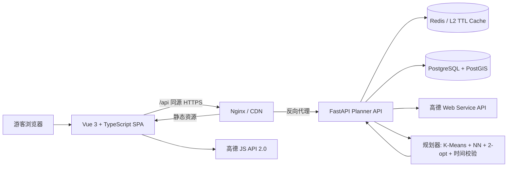
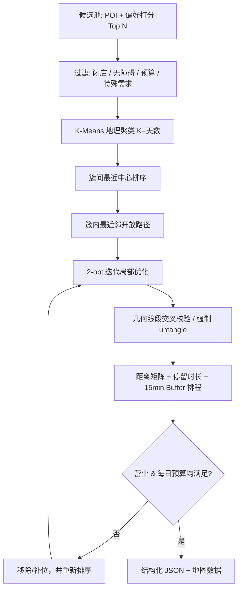

# 行迹智能旅游路线规划软件｜系统架构设计

**版本**：1.0  
**目标用户**：自由行游客、亲子/银发出行组织者、旅行顾问  
**核心承诺**：一次输入偏好，产出可执行的按日路线；在满足营业时间、每日时间预算和缓冲时间的前提下，尽量减少总移动时间，避免跨区折返和路线自交。

---

## 1. 产品边界与成功指标

### 1.1 用户旅程

1. 用户输入城市/区域、停留天数或总小时数、偏好与出行方式。
2. 前端对目的地调用自动补全；提交后 API 从高德 POI 构建候选池。
3. 规划器按地理区域分天，再在每一日内排序、2-opt 消除交叉，并做时段/营业校验。
4. 返回结构化 JSON。左侧渲染可拖拽行程卡，右侧渲染高德地图标记与顺序线，底部渲染时间轴。
5. 点击卡片聚焦地图；拖拽重排立即重绘并可调用重排 API 做服务端时间重算；切换出行方式重新请求距离矩阵与规划结果。

### 1.2 可量化指标

| 指标 | 目标 | 口径 |
|---|---:|---|
| 路线自交率 | 0 | 输出前 `route_has_crossings` 必须为 false |
| 每日预算违规率 | 0 | `游览 + 交通 + Buffer + 休息 <= dailyHours` |
| 同日跨区域往返 | 最小化 | K-Means 簇内方差、日间簇中心跳转距离 |
| 可执行景点占比 | > 90% | 到达时营业且停留时间覆盖开放窗口 |
| POI/规划 P95 | < 3s（命中缓存） | 观测 API + AMap 依赖耗时 |
| 地图联动响应 | < 100ms（本地） | 列表选择、拖拽重绘不等待网络 |

### 1.3 非目标（v1）

- 不替代景点官方预约、购票与实时排队系统。
- 不承诺临时封路、恶劣天气或 AMap 实时路况之外的预测准确性。
- 不在浏览器保存高德 Web Service Key、支付信息或精确历史轨迹。

---

## 2. 总体架构



### 2.1 分层职责

| 层 | 组件 | 责任 |
|---|---|---|
| 表现层 | Vue 3、Vite、原生拖拽 | 表单、日期 Tab、路线列表、时间线、乐观重排、错误态 |
| 地图层 | AMap JS API 2.0 | 底图、Marker、InfoWindow、Polyline、缩放/拖拽、地图聚焦 |
| API 层 | FastAPI、Pydantic | 参数校验、OpenAPI、认证/限流钩子、CORS、错误标准化 |
| 领域层 | `PlanningService` | 候选池、线路编排、结果 JSON、服务降级策略 |
| 优化层 | `optimizer.py` | 聚类、最近邻、开放路径 2-opt、几何交叉检查、时间排程 |
| 外部适配层 | `AmapClient` | 目的地提示、地理编码、POI、距离矩阵；超时/空结果降级 |
| 数据层 | PostgreSQL/PostGIS、Redis | POI 快照、用户行程、分享、空间检索、热点缓存 |
| 运维层 | Docker、Nginx、Prometheus/OTel（生产） | 健康检查、日志、指标、告警、TLS 与灰度发布 |

### 2.2 前后端模块映射

```text
frontend/src/
├── App.vue                   # 页面状态、日期切换、导出/分享、重算编排
├── components/TripForm.vue   # 输入参数与自动建议 UX
├── components/ItineraryPanel.vue # 卡片、点击/拖拽
├── components/MapCanvas.vue  # AMap 动态加载 / Marker / Polyline / 降级预览
├── components/TimelineStrip.vue  # 横向时段视图
└── services/api.ts           # API 契约、演示降级

backend/app/
├── api.py                    # REST endpoints
├── models.py                 # Pydantic input/output model
├── services/amap.py          # 高德 Web Service adapter
├── services/catalog.py       # 离线演示 POI、偏好打分
├── services/optimizer.py     # 算法核心，无第三方 ML 依赖
└── services/planner.py       # 用例编排与输出转换
```

---

## 3. 数据流与高德集成

### 3.1 一次规划请求

```mermaid
sequenceDiagram
  participant UI as Vue UI
  participant API as FastAPI
  participant Cache as Redis/L2
  participant AMap as 高德 Web Service
  participant OPT as Optimizer
  UI->>API: POST /api/v1/plans
  API->>Cache: 查询 destination + preferences + mode
  alt 未命中
    API->>AMap: POI 关键词 / 周边搜索
    AMap-->>API: 坐标、类型、地址、营业信息
    API->>AMap: 距离矩阵（按目的地批量）
    AMap-->>API: 距离、预计时间
    API->>Cache: 写候选池与距离矩阵（TTL）
  end
  API->>OPT: cluster → NN → 2-opt → schedule
  OPT-->>API: 按日 RoutePlan
  API-->>UI: 结构化 JSON
  UI->>UI: 卡片 / 时间轴 / 地图点线同步渲染
```

### 3.2 高德 API 职责

| 高德能力 | 调用方 | 用途 | 缓存建议 |
|---|---|---|---|
| JS API 2.0 | 浏览器 | 实际底图、Marker、InfoWindow、Polyline、控件 | 浏览器 SDK 自带；不缓存 Key |
| 输入提示 `assistant/inputtips` | 后端 | 目的地模糊搜索自动补全 | 1h |
| 地理编码 `geocode/geo` | 后端 | 区域 → 坐标、簇排序的起点 | 7d |
| POI 文本/周边搜索 | 后端 | 偏好候选池、地址、坐标、类型 | 15–60min |
| 距离 API（批量 origins） | 后端 | N×N 移动时间/距离矩阵 | 5–15min，按 mode 分 Key |
| Direction（可选） | 后端/前端 | 真实道路几何、逐段导航详情 | 5min；请求量大时按需加载 |
| 路况（可选） | 后端 | 自驾时间修正、路线健康度 | 2–5min |

> AMap 的 API 版本、配额及参数限制以官方最新文档为准。适配器把外部字段收敛为 `CandidatePoi` / `TravelMetric`，使 API 版本升级不会污染优化器。

### 3.3 Key 与安全模型

- `VITE_AMAP_JS_KEY` 是浏览器 Key，只允许高德 JS API 使用；在控制台绑定正式域名/Referer，并配置 `VITE_AMAP_SECURITY_JS_CODE`。
- `AMAP_WEB_SERVICE_KEY` 仅进入 FastAPI 容器环境；**禁止**以 `/config`、前端环境变量、日志、错误信息或计划 JSON 形式发送给浏览器。
- API 使用同源 `/api` Nginx 反向代理，浏览器永远不调用 `localhost` 或容器内部地址。
- 生产环境增加用户认证、IP/用户维度速率限制、请求体大小限制与审计字段 `request_id`。
- 高德响应中的地址、电话等非必要字段不原样持久化，遵循最小化数据原则。

### 3.4 降级策略

| 异常 | 行为 | 用户可见结果 |
|---|---|---|
| AMap 限流/超时 | 命中 Redis；未命中时用 PostGIS/本地缓存候选 + Haversine 道路系数 | 标注“估算交通时间”，仍给出可编辑行程 |
| 无 JS Key | `MapCanvas` 显示离线地图预览 | 完整点线联动可评审，提示配置 Key 切换实时底图 |
| POI 不足 | 放宽次级偏好、扩半径；仍不足不跨区硬凑 | 明确建议增加天数/放宽偏好 |
| 目的地定位失败 | 保留文本、要求选择自动补全或地图点选 | 不生成误导路线 |
| 营业时间冲突 | 跳过/换位，重新排程 | 提醒具体景点和原因 |
| 交通矩阵不完整 | 缺腿使用模式化道路距离估算 | `source=mixed`，保留来源可追溯性 |

---

## 4. 路线优化设计

### 4.1 输入和输出

输入为 `destination`、时间预算、偏好、交通方式、同行限制和可选 `startDate/startLocation`。输出严格遵循产品约定：

```text
PlanResponse
 ├─ routes[] DayRoute
 │   ├─ spots[] RouteSpot（坐标、到离时间、下一段距离/交通）
 │   ├─ totalDistance / totalVisitDuration / totalTransportDuration
 │   └─ notices（营业、高峰、缓冲）
 └─ overallStats（总距离、总景点、backtrackCheck）
```

### 4.2 算法流程



### 4.3 关键选择

#### 候选池与评分

`N = min(maxCandidatePool, max(12, days × 6))`。候选分数由高德评分/热度（若有）、偏好命中数量、可达性、预算和特殊需求组成。先过滤不可用项，而不是在最后删除，以免路线重排失真。

#### 地理聚类分天

对经纬度实现了无 `sklearn` 依赖的确定性 K-Means：

- `K = min(请求天数, 候选数)`；
- 用经度排序后的分位点初始化，避免随机结果；
- 经度按纬度余弦校正，适合城市尺度；
- 空簇由最分散样本补齐；
- 之后按相邻簇中心贪心排序，连续日期在相邻区域移动。

这一步是“同区域景点集中”的主要约束。候选不足时宁可返回空闲日，不强行将远端景点塞进一天。

#### 簇内开放路径，不是闭环 TSP

旅行日通常在一个区域入口开始、另一个出口结束，不应强制回到第一个景点。因此路线是 `open path`，路径成本为：

\[
C(P) = \sum_{i=1}^{n-1} (t(P_i,P_{i+1}) + \lambda d(P_i,P_{i+1}))
\]

- 初始点：离用户出发点最近，若无出发点则取区域边缘确定性起点；
- 初始解：最近邻贪心，时间复杂度 `O(n²)`；
- 无“尾点回首点”成本，天然避免为了回到起点产生的折返。

#### 2-opt 与无交叉硬校验

对开放路径的两个不相邻边 `(i,i+1)`、`(j,j+1)`，若反转中段可降低矩阵距离则接受：

\[
P' = P[0:i+1] + reverse(P[i+1:j+1]) + P[j+1:n]
\]

此外，`segments_intersect` 做独立几何检测。即使实时矩阵出现不满足三角不等式的异常值，也会先执行 `_untangle` 交换交叉边，再做成本优化。营业过滤删除节点后，再做一次 2-opt/交叉校验，保证输出路径仍不自交。

#### 时间、Buffer 与营业时间

每个候选有类型/POI 估算停留分钟数。日程累计：

\[
T_{day} = \sum T_{visit} + \sum T_{traffic} + 15\times(n-1) + T_{meal} \leq H_{daily}\times60
\]

- 每对已接受的景点之间增加 **15 分钟 Buffer**；
- 11:40–13:00 经过非餐饮景点时保留 40 分钟用餐/休息；
- `opening_adjusted_arrival` 解析 `HH:MM-HH:MM`、全天开放和闭馆日；若早到则顺延，若离开超过闭店/超过日预算则跳过；
- 每簇最多 6 个，优先达到 3–6 个的体验平衡；少于 3 个时只从**同簇**补位，绝不跨城补点。

### 4.4 算法复杂度与容量

设候选池大小为 `N`、天数为 `K`、单日点数为 `m ≤ 6`：

| 阶段 | 复杂度 | 说明 |
|---|---:|---|
| 偏好排序 | `O(N log N)` | N 通常 ≤ 36 |
| K-Means | `O(iter × N × K)` | iter 上限 40 |
| 最近邻 | `O(m²)` | 每日 m ≤ 6 |
| 2-opt | `O(pass × m³)` | m 很小；pass 上限 30 |
| 距离矩阵 | 外部 I/O | 每目的地批量 origins，Redis TTL 避免重复 |

这比精确 TSP 更适合交互式产品：在城市级 36 候选下 API CPU 计算通常远低于外部地图 I/O，同时可解释、可重算。

### 4.5 可扩展优化

1. 用 AMap Direction 的实际路段多段 geometry 代替直线 Polyline。
2. 在代价函数中加入实时拥堵、票价、用户对步行的惩罚系数。
3. 对主题乐园等半日/全天 POI 设置“独占日”约束，而非与普通 POI 聚类。
4. 引入 OR-Tools/CP-SAT 处理酒店固定起终点、预约窗口、多人集合等多约束 VRPTW。
5. 使用历史拥挤度按小时修正 `T_traffic`，并在行前一天异步复算推送。

---

## 5. 状态与交互设计

### 5.1 前端状态

| 状态 | 所属 | 作用 |
|---|---|---|
| `TravelForm` | `TripForm` / `App` | 用户输入、可序列化为 API request |
| `PlanResponse` | `App` | 全局路线真相源 |
| `activeDay` | `App` | 日期 Tab、列表、地图和时间线共同过滤 |
| `selectedSpot` | `App` | 卡片高亮、地图 InfoWindow、时间轴高亮 |
| `activeTransport` | `App` | 地图图例与请求重新规划 |
| `showAllDays` | `MapCanvas` | 当前日 / 全部日叠加路线 |

### 5.2 联动约束

- **卡片 → 地图**：`select` 事件更新 `selectedSpot`，AMap `InfoWindow.open` + `setFitView`/中心聚焦。
- **地图 Marker → 卡片**：Marker click 发射同一 `select`，无需两套选择逻辑。
- **时间轴 → 地图**：时间块发射 `select`。
- **拖拽 → 地图**：列表输出重排 spots；`PlanResponse` 不可变更新，`MapCanvas` watcher 清除/重新加 Marker 与 Polyline；随后可请求 `/plans/reorder` 进行服务端校时。
- **切换方式**：保留当前可见路线直到重算返回，避免白屏；返回后替换距离、时间和 Polyline。

### 5.3 可访问性与响应式

- 所有交互点为 `<button>`，包含 `aria-label`；焦点可见样式应在上线前做键盘审计。
- 桌面：40% 输入/列表 + 60% 地图；移动端：地图在上、表单和列表在下，保持完整功能。
- 颜色不是唯一编码：每日线条另有 Day 标签和顺序数字；高德信息窗含文字详情。

---

## 6. 数据、缓存与一致性

### 6.1 缓存键

```text
poi:{city}:{sorted_preferences}:{radius}:{page}
matrix:{transport_mode}:{ordered_poi_ids_hash}
geocode:{normalized_address}
plan:{request_normalized_hash}:{poi_snapshot_version}
```

- POI 15–60 分钟；距离/路况 5–15 分钟；地址 7 天；完整行程 5–15 分钟。
- 行程缓存必须包含 `startDate` 的日期和时间桶（例如 15 分钟），否则营业/交通结果会串用。
- 代码在无 Redis 时使用有界 L2 TTL cache，保证本地可运行；生产部署将同一接口替换为 Redis 集群/托管 Redis。

### 6.2 持久化策略

- `poi_snapshots` 保存查询时可用的最小 POI 属性和来源版本，便于复盘；不是高德全量数据仓库。
- `itinerary_plans` 存请求快照、算法版本、状态和总指标。
- `itinerary_stops` 存不可变的输出快照，用户分享后不会因 POI 后续变更而失真。
- geometry 用 PostGIS `geography(Point,4326)`，区域/附近查询使用 GiST 索引。
- schema 见 [database.sql](database.sql)。

---

## 7. 可靠性、观测与测试

### 7.1 错误响应

统一 JSON：

```json
{
  "error": {
    "code": "AMAP_TIMEOUT",
    "message": "地图服务暂时不可用，已使用距离估算。",
    "requestId": "...",
    "retryable": true
  }
}
```

当前 MVP 对外通过 `warnings` 标注降级；生产建议加 FastAPI exception handler、Sentry、`X-Request-ID` 和幂等键。

### 7.2 应观测的指标

- `planner_request_total{status,source,mode}`
- `planner_latency_seconds{stage=poi|matrix|optimize}`
- `amap_request_total{endpoint,status}`、`amap_rate_limit_total`
- `route_crossing_repair_total`、`route_budget_trim_total`、`opening_hours_skip_total`
- `cache_hit_ratio{kind}`
- `itinerary_spots_per_day`、`distance_estimate_fallback_ratio`

### 7.3 已覆盖测试

`backend/tests` 覆盖：

- 交叉四边形经 2-opt 后无交叉且起点稳定；
- K-Means 分离相距较远的区域；
- 日预算与 Buffer 硬边界；
- 小时制行程产生短的最后一天；
- 无高德 Key 的端到端规划仍输出无交叉路线。

上线前应增加：真实 AMap 沙箱 contract test、营业时间跨日/节假日 property test、200 并发压测、浏览器地图 E2E（Playwright）和 POI 配额故障演练。

---

## 8. 发布分期建议

| 阶段 | 能力 | 上线门槛 |
|---|---|---|
| MVP（本工程） | 输入、离线/高德候选、NN+2opt、地图联动、导出 JSON | Key 安全、单元测试、响应式验收 |
| Beta | 用户账户、PostGIS 行程保存、Redis、真实 Direction geometry、分享短链 | 监控、限流、隐私声明 |
| GA | 酒店起终点、预约/票务、实时路况再规划、协作编辑、PDF | SLA、备份恢复、风控与灰度 |

**验收结论**：该设计将“不回头、无交叉、每日不超时、营业可达、地图与列表联动”作为可验证的程序不变量，而非仅作为推荐文案。
